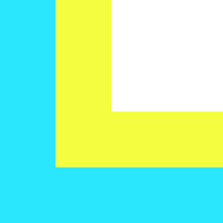

# Louk
_Vue without the HTML_

## Intro

Vue is a beautiful technology, but it’s always felt a bit awkward crammed into old-school HTML. Louk is a tailor-made notation and preprocessor that hides the wonky stuff and lets Vue shine.

The key is that most things are interpreted as dynamic Vue entities (bound content and attributes) by default, while anything else is escaped with a single character. This means markup like `{{ }}` and `v-` becomes unnecessary, as it’s just assumed.

Louk runs on Node, and can compile standalone markup into HTML files (via task runners like gulp) or embedded markup in single file components (via module loaders such as webpack).

## Installation
```sh
$ npm install louk -D
```
If using with webpack, you'll also want to install the [Louk Loader](https://github.com/agorischek/louk-loader).

## Notation

### Elements & Content

Elements are denoted by their tags as the first visible characters on a line. Nested elements are indented, and closing tags are implied. Self closing elements are followed with a forward slash.

```html
//louk
h1
div
    br/

//html
<h1></h1>
<div>
    <br />
</div>
```

Element content follows the tag on the same line, separated by a space. Content is interpreted as dynamic by default.

```html
//louk
div string

//html
<div>{{string}}</div>
```

### Directives & Attributes

Directives and other attributes are denoted by prefixes and follow their corresponding element on separate lines.

```html
//louk
ul
:class focus
    li
    -for item in items

//html
<ul v-bind:class="focus">
    <li v-for="item in items"></li>
</ul>
```

Simple directives are denoted by a leading hyphen.

`-if` becomes `v-if`

`-for` becomes `v-for`

`-model` becomes `v-model`


Binding directives are denoted by a leading colon.

`:id` becomes `v-bind:id`

`:class` becomes `v-bind:class`

`:href` becomes `v-bind:href`


Action directives are denoted by a leading at sign.

`@click` becomes `v-on:click`

`@submit` becomes `v-on:submit`

`@keyup.enter` becomes `v-on:keyup.enter`


### Escaping & Statics

Content can be made static by escaping the tag with a trailing tilde.

`p~ Hello world!` becomes `<p>Hello world!</p>`

Attributes can be made static by escaping the attribute name with a leading tilde.

`~type text/css` becomes `type="text/css"`

Additionally, the `class`, `id`, and `href` attributes can be made static by escaping the attribute value with a leading period, pound sign, or closing angle bracket, respectively.

`.center` becomes `class="center"`

`#install` becomes `id="install"`

`>example.org` becomes `href="example.org"`

### Comments & HTML

Comments are indicated with two leading forward slashes.

```html
//louk
div save
//Triggers dialog
@click confirm

//html
<div v-bind:click="confirm">{{save}}</div>
```
